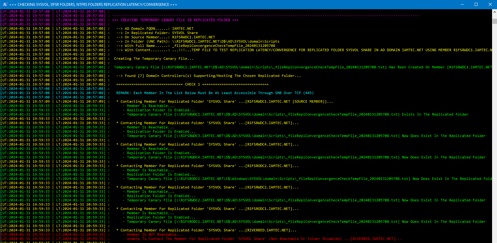
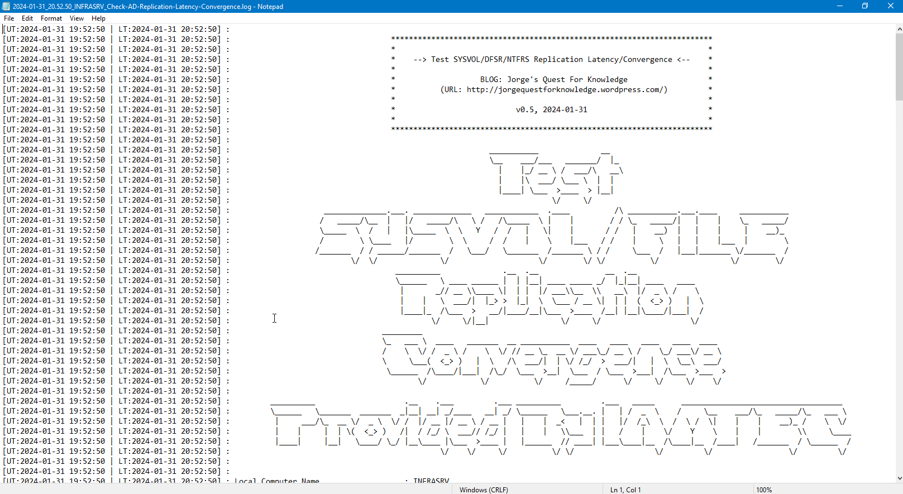
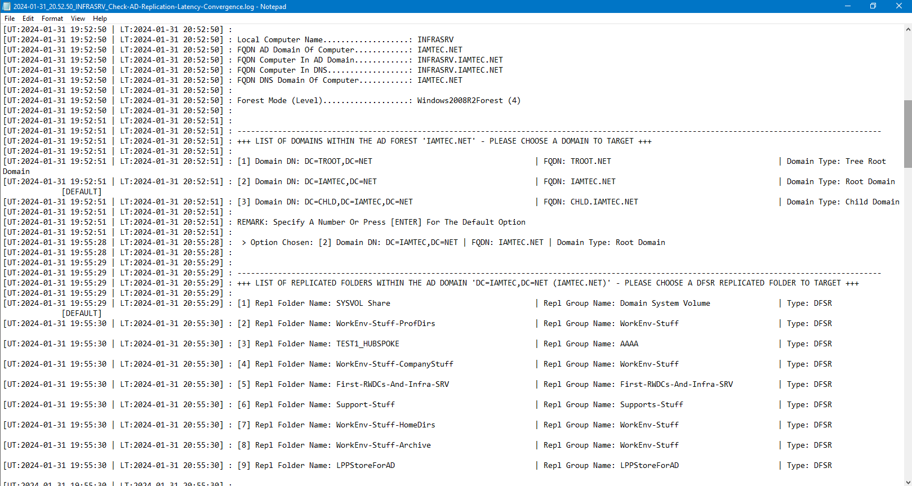
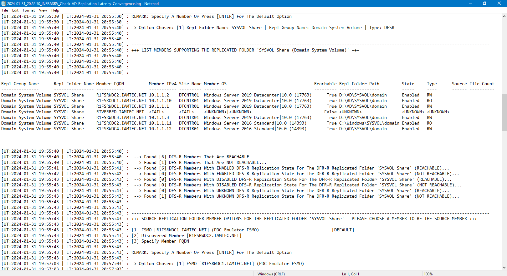
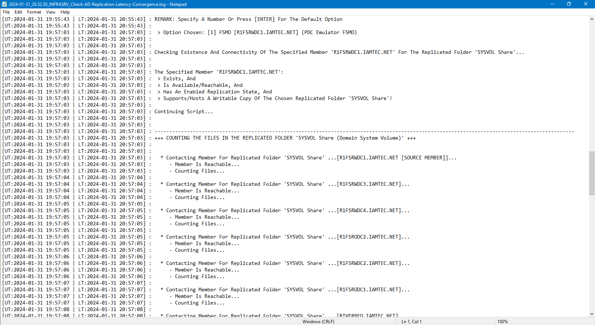
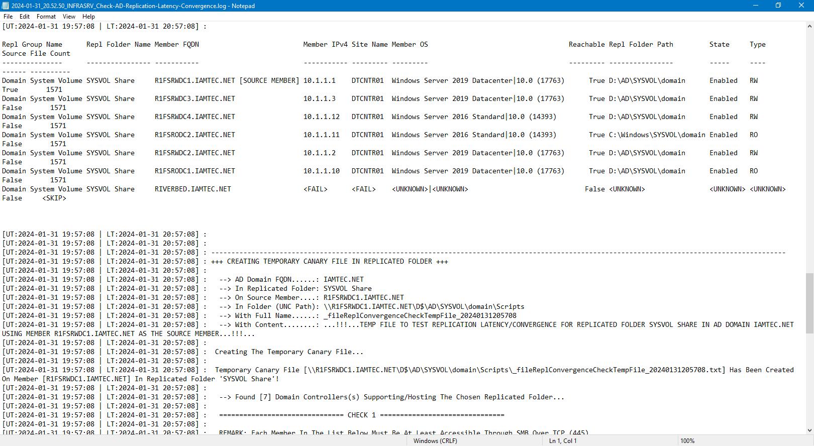
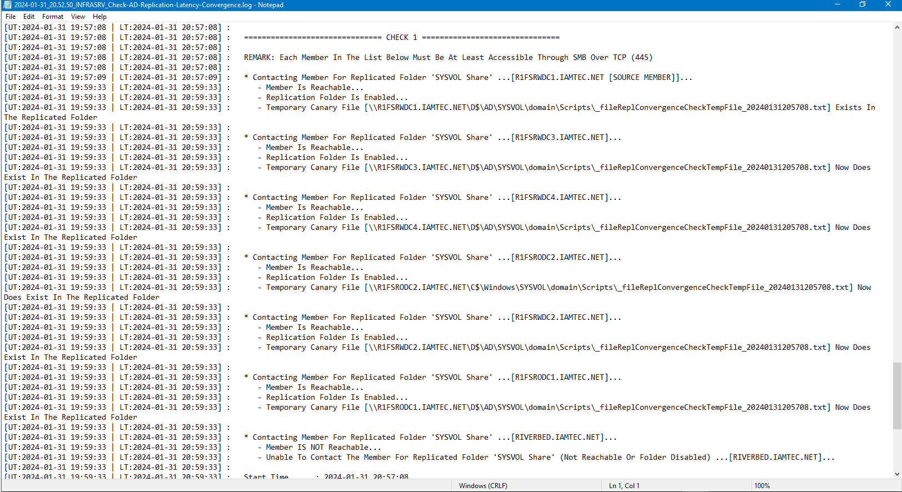

# SCRIPT: Check-SYSVOL-And-DFSR-And-NTFRS-Folders-Replication-Latency-Convergence

## AUTHOR/FEEDBACK

* Written By: Jorge de Almeida Pinto [MVP Security / Lead Identity/Security Architect]
* Re-Written By: N.A.
* Company: IAMTEC &gt;&gt; Identity | Security | Recovery [https://www.iamtec.eu/]
* Blog: Jorge's Quest For Knowledge [http://jorgequestforknowledge.wordpress.com/]
* For Feedback/Questions: scripts DOT gallery AT iamtec.eu
  * Please Describe Your Scenario As Best As Possible With As Much Detail As Possible.
  * If Applicable Describe What Does and/Or Does Not Work.
  * If Applicable Describe What Should Be/Work Different And Explain Why/How.
  * Please Add Screendumps.

## ORIGINAL SOURCE(S)

* <https://github.com/zjorz/Public-AD-Scripts/blob/master/Check-SYSVOL-And-DFSR-And-NTFRS-Folders-Replication-Latency-Convergence.ps1>

## DISCLAIMER

* The script is FREEWARE, you are free to distribute/update it, but always refer to the original source(s) as the location where you got it
* This script is furnished "AS IS". NO warranty is expressed or implied!
* I HAVE NOT tested it in every scenario or environment
* ALWAYS TEST FIRST in lab environment to see if it meets your needs!
* Use this script at YOUR OWN RISK! YOU ARE RESPONSIBLE FOR ANY OUTCOME/RESULT BY USING THIS SCRIPT!
* I DO NOT warrant this script to be fit for any purpose, use or environment!
* I have tried to check everything that needed to be checked, but I DO NOT guarantee the script does not have bugs!
* I DO NOT guarantee the script will not damage or destroy your system(s), environment or anything else due to improper use or bugs!
* I DO NOT accept liability in any way when making mistakes, use the script wrong or in any other way where damage is caused to your environment/systems!
* If you do not accept these terms DO NOT use the script in any way and delete it immediately!

## KNOWN ISSUES/BUGS

* N.A.

## RELEASE NOTES

* v0.6, 2024-02-06, Jorge de Almeida Pinto [MVP Security / Lead Identity/Security Architect]:

  * Code Improvement: Changed the function "getDFSRReplGroupMembers" to not use a GC, but instead use a RWDC from the respective AD domain of the object that is being looked for
  * Code Improvement: When discovering a member, added a check to choose a member with a writable copy of the replicated folder
  * Improved User Experience: Added a check to determine if there are Temporary Canary Object leftovers from previous executions of the script that were not cleaned up because the script was aborted or it crashed
  *	Improved User Experience: Changed the timing column from "Time" to "TimeDiscvrd" (Time Discovered) which specifies how much time it took to find/see the file on the member of the replicated folder
  *	Improved User Experience: The AD domain list presented is now consistently presented in the same order
  *	Bug Fix: Fixed the unc path for the folder when SYSVOL is still using NTFRS. Temporary Canary File is now created in the Scripts folder (SYSVOL only!)
  *	Bug Fix: When not using SYSVOL as replicated folder, fixed the Member to target for checking the existence of the Temporary Canary File
  *	Bug Fix: Changed the variable name of the unc path for the folder on the source from $uncPathFolder to $uncPathFolderSource, to also target the correct (source) Member for cleanup of the file

* v0.5, 2024-01-31, Jorge de Almeida Pinto [MVP Security / Lead Identity/Security Architect]:

  * Script Improvement: Complete rewrite of the script
  * New Feature: Parameters added to support automation
  * New Feature: Logging Function
  * New Feature: Support for all replicated folders (SYSVOL and Custom), replicated either through NTFRS or DFSR
  * New Feature: File count across each member (enabled by default), can be disabled with parameter
  * Code Improvement: As target member use specific role owner hosting the PDC FSMO (SYSVOL only!), disccovered member, specific member

* v0.4, 2014-02-11, Jorge de Almeida Pinto [MVP Security / Lead Identity/Security Architect]:
  * Code Improvement: Added additional logic to determine if a DC is either an RWDC or RODC when it fails using the first logic and changed the layout a little bit

* v0.3, 2014-02-09, Jorge de Almeida Pinto [MVP Security / Lead Identity/Security Architect]:
  * Bug Fix: Solved a bug with regards to the detection/location of RWDCs and RODCs

* v0.2, 2014-02-01, Jorge de Almeida Pinto [MVP Security / Lead Identity/Security Architect]:

  * New Feature: Updated to also work on W2K3
  * New Feature: Added STOP option
  * Code Improvement: Added few extra columns to output extra info of DCs,
  * Code Improvement: Better detection of unavailable DCs/GCs
  * Code Improvement: Added screen adjustment section

* v0.1, 2013-03-02, Jorge de Almeida Pinto [MVP Security / Lead Identity/Security Architect]:
  * Initial version of the script

## SYNOPSIS/DESCRIPTION

This PoSH Script Checks The File Replication Latency/Convergence For Replicated Folders (SYSVOL And Custom) Using Either NTFRS Or DFSR.

This PoSH script provides the following functions:

* It executes on a per replicated folder basis. For multiple replicated folder use automation with parameters
* For automation, it is possible to define the FQDN of the AD Domain to target, the name of the replica set (NTFRS) or the name of the replicated folder (DFSR) within that AD domain, and the member to use as the source member to create the temoporary canary file on
* It supports non-interacive mode through automation with parameters, or interactive mode
* It supports file replication convergence check for any replica set (NTFRS) or replicated folder (DFSR) within an AD forest.
* As the source member, it is possible to:
  * Use the FSMO of the AD Domain, when it concerns the SYSVOL only
  * Use a discovered member (best effort)
  * Specify the FQDN of a member that hosts the replica set (NTFRS) or the replicated folder (DFSR)
* For the temporary canary file:
  * Initially created on the source member and deleted from the source member at the end
  * Name            = _fileReplConvergenceCheckTempFile_yyyyMMddHHmmss (e.g. _fileReplConvergenceCheckTempFile_20240102030405)
  * Content         = ...!!!...TEMP FILE TO TEST REPLICATION LATENCY/CONVERGENCE FOR REPLICATED FOLDER &lt;REPLICA SET NAME (NTFRS) OR REPLICATED FOLDER NAME (DFSR)&gt; IN AD DOMAIN &lt;AD DOMAIN FQDN&gt; USING MEMBER &lt;SOURCE MEMBER&gt; AS THE SOURCE MEMBER...!!!...
  * Container:
    * For custom replicated folders    =&gt; Folder = At the root of the folder
    * For SYSVOL                       =&gt; Folder = "&lt;SYSVOL LOCAL PATH&gt;\Scripts"
* All is displayed on screen using different colors depending on what is occuring. The same thing is also logged to a log file without colors
* It checks if specified replica set (NTFRS) or replicated folder (DFSR) exists. If not, the script aborts.
* It checks if specified member exists. If not, the script aborts.
* At the end it checks if any Temporary Canary Files exist from previous execution of the script and offers to clean up (In the chosen Replicated Folder only!).
* Disjoint namespaces and discontiguous namespaces are supported.
* During interactive mode, after specifying the source member, it will count the files in the replicated folder on every member by default. This can be disabled through a parameter.

## PARAMETER(S)

skipFileCount

* With this parameter it is possible not count files in the replicated folder on every member

targetDomainFQDN

* With this parameter it is possible to specify the FQDN of an AD domain to target for File Replication Convergence/Latency check against a chosen replica set (NTFRS) or the replicated folder (DFSR) within that AD domain

targetReplFolder

* With this parameter it is possible to specify the name of the replica set (NTFRS) or the replicated folder (DFSR) within the chosen AD domain to target for the File Replication Convergence/Latency check

targetReplMember

* With this parameter it is possible to specify the member to use to create the temporary canary file on. Options that are available for this are "Fsmo" (SYSVOL only!), "Discover" or the FQDN of a member

## EXAMPLE(S)

Check The File Replication Convergence/Latency Using Interactive Mode (Including File Count)

``` powershell
.\Check-SYSVOL-And-DFSR-And-NTFRS-Folders-Replication-Latency-Convergence.ps1
```

Check The File Replication Convergence/Latency Using Interactive Mode (Excluding File Count)

``` powershell
.\Check-SYSVOL-And-DFSR-And-NTFRS-Folders-Replication-Latency-Convergence.ps1 -skipFileCount
```

Check The File Replication Convergence/Latency Using Automated Mode For The SYSVOL Replicated Through NTFRS Using The Fsmo Role Owner As The Source Member To Create The Temporary Canary File On (Including File Count)

``` powershell
.\Check-SYSVOL-And-DFSR-And-NTFRS-Folders-Replication-Latency-Convergence.ps1 -targetDomainFQDN IAMTEC.NET -targetReplFolder "Domain System Volume (SYSVOL share)" -targetReplMember Fsmo
```

Check The File Replication Convergence/Latency Using Automated Mode For The SYSVOL Replicated Through DFSR Using The Fsmo Role Owner As The Source Member To Create The Temporary Canary File On (Including File Count)

``` powershell
.\Check-SYSVOL-And-DFSR-And-NTFRS-Folders-Replication-Latency-Convergence.ps1 -targetDomainFQDN IAMTEC.NET -targetReplFolder "SYSVOL Share" -targetReplMember Fsmo
```

Check The File Replication Convergence/Latency Using Automated Mode For The Replicated Folder "LPPStoreForAD" Using A Discovered Member As The Source Member To Create The Temporary Canary File On (Including File Count)

``` powershell
.\Check-SYSVOL-And-DFSR-And-NTFRS-Folders-Replication-Latency-Convergence.ps1 -targetDomainFQDN IAMTEC.NET -targetReplFolder "LPPStoreForAD" -targetRWDC Discover
```

Check The File Replication Convergence/Latency Using Automated Mode For The Replicated Folder "LPPStoreForAD" Using A Specific Member As The Source Member To Create The Temporary Canary File On (Including File Count)

``` powershell
.\Check-SYSVOL-And-DFSR-And-NTFRS-Folders-Replication-Latency-Convergence.ps1 -targetDomainFQDN IAMTEC.NET -targetReplFolder "LPPStoreForAD" -targetRWDC "R1FSRWDC1.IAMTEC.NET"
```

Check The File Replication Convergence/Latency Using Automated Mode For The SYSVOL Replicated Through NTFRS Using The Fsmo Role Owner As The Source Member To Create The Temporary Canary File On (Excluding File Count)

``` powershell
.\Check-SYSVOL-And-DFSR-And-NTFRS-Folders-Replication-Latency-Convergence.ps1 -targetDomainFQDN IAMTEC.NET -targetReplFolder "Domain System Volume (SYSVOL share)" -targetReplMember Fsmo -skipFileCount
```

Check The File Replication Convergence/Latency Using Automated Mode For The SYSVOL Replicated Through DFSR Using The Fsmo Role Owner As The Source Member To Create The Temporary Canary File On (Excluding File Count)

``` powershell
.\Check-SYSVOL-And-DFSR-And-NTFRS-Folders-Replication-Latency-Convergence.ps1 -targetDomainFQDN IAMTEC.NET -targetReplFolder "SYSVOL Share" -targetReplMember Fsmo -skipFileCount
```

Check The File Replication Convergence/Latency Using Automated Mode For The Replicated Folder "LPPStoreForAD" Using A Discovered Member As The Source Member To Create The Temporary Canary File On (Excluding File Count)

``` powershell
.\Check-SYSVOL-And-DFSR-And-NTFRS-Folders-Replication-Latency-Convergence.ps1 -targetDomainFQDN IAMTEC.NET -targetReplFolder "LPPStoreForAD" -targetRWDC Discover -skipFileCount
```

Check The File Replication Convergence/Latency Using Automated Mode For The Replicated Folder "LPPStoreForAD" Using A Specific Member As The Source Member To Create The Temporary Canary File On (Excluding File Count)

``` powershell
.\Check-SYSVOL-And-DFSR-And-NTFRS-Folders-Replication-Latency-Convergence.ps1 -targetDomainFQDN IAMTEC.NET -targetReplFolder "LPPStoreForAD" -targetRWDC "R1FSRWDC1.IAMTEC.NET" -skipFileCount
```

## NOTES

* To execute this script, the account running the script MUST have the permissions to create and delete the file in the local folder of the source member through the drive share (C$, D$, etc). Being a local admin on all
  the member allows, the creation, deletion and monitoring of the file
* The credentials used are the credentials of the logged on account. It is not possible to provided other credentials. Other credentials could maybe be used through RUNAS /NETONLY /USER
* No check is done for the required permissions
* No PowerShell modules are needed to use this script
* For the SYSVOL, it only works correctly when either using NTFRS, or DFSR in a completed state!
* Admin shares must be enabled
* For File Count, WinRM must be possible against the remote machines
* Yes, I'm aware, there is duplicate code to support both NTFRS and DFSR. This was the easiest way to support both without too much complexity. It also allows to remove it easily when NTFRS cannot be used anymore

## SCREENSHOTS


















